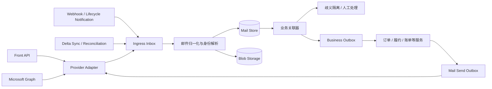

# 邮件功能重构设计

> 选题：题目一「邮件功能重构设计」

## 先说结论

这次重构表面上是把 Front API 换成 Microsoft Graph，实际要解决的不是 API 兼容，而是三个更底层的问题：

1. 业务系统错误地把第三方 `message id` 当成了自己的主键；
2. 邮件接收、附件处理、业务更新之间缺少可重放、可对账的边界；
3. 迁移一旦出错，缺少把影响限制在单个 mailbox、单条业务链路的手段。

所以我的核心方案不是做一个更厚的 Graph SDK，而是在业务与邮件供应商之间建立一层稳定的邮件域模型。Front 和 Graph 都只是外部数据源，业务单据只关联内部 `mail_id`，不再直接依赖任何 provider id。

另外，我不会把 Webhook 当作可靠消息队列。Webhook 只负责告诉系统“可能有变化”，Delta Query 和定期对账才负责回答“究竟变了什么”。整个链路按至少一次投递设计，通过幂等达到业务上的 exactly-once effect。

## 一、我如何理解核心问题

### 1. 身份问题比同步问题更危险

邮件系统里其实同时存在几种不同的“身份”：

- Graph `id`：某个 mailbox 中的资源定位符。默认格式在移动文件夹时可能变化；
- Graph Immutable ID：同一 mailbox 内移动文件夹不变，但移动到 archive mailbox、导出再导入时仍会变化；
- `internetMessageId`：邮件 MIME 头中的 Message-ID，适合辅助匹配，但可能为空、重复或被不规范的发件系统重写；
- `conversationId`：适合展示会话，不适合拿来标识一封具体邮件，更不能直接等同于业务单据；
- 业务身份：询价、订单、预约等业务动作真正需要关联的对象。

如果数据库把其中任何一个外部字段直接当业务主键，迁移只是把旧的不稳定依赖换成新的不稳定依赖。因此我要引入内部生成、永不变化的 `mail_id`。外部 ID 只作为“定位这封邮件的一种凭据”，允许一封内部邮件对应多个历史 locator。

这也是我认为当前“邮件与业务单据关联不稳定”的根因：系统很可能把**外部定位符、会话归属和业务归属混成了同一件事**。

### 2. 真正需要保证的是业务效果，而不是每层都“恰好一次”

Graph 通知可能重复、延迟甚至丢失；网络超时也无法区分“请求没有执行”和“执行成功但响应丢了”。强行在接入层承诺 exactly once 不现实。

我会把链路拆成以下几个可独立重试的阶段：

```text
接收变化 -> 保存原始事件 -> 拉取邮件快照 -> 归一化 -> 关联附件
         -> 判定业务归属 -> 生成业务命令 -> 执行业务副作用
```

每个阶段都持久化状态和幂等键。上游重复最多造成重复计算，不会造成重复建单、重复上传附件或重复发送邮件。

### 3. 最大风险不是停机，而是“静默关联错误”

服务挂了通常容易发现，恢复后还能补数据。更危险的是系统正常返回 200，却把 A 订单的附件挂到了 B 订单，或者重复触发履约、账单更新。这类错误会穿透多个业务环节，几天后才被发现，而且很难回滚。

因此我的风险优先级是：

1. 错关联、重复副作用；
2. 重复发信；
3. 漏信、同步延迟；
4. 接口短时不可用。

设计上宁可把低置信度邮件放进待处理队列，也不自动猜一个业务单据。这是有意选择 correctness over availability。

## 二、目标架构



### 2.1 Provider Adapter：隔离供应商差异，但不过度抽象

对业务只暴露几种稳定能力：

```ts
interface MailProvider {
  getMessage(locator: ProviderLocator): Promise<ProviderMessage>;
  listAttachments(locator: ProviderLocator): Promise<ProviderAttachment[]>;
  downloadAttachment(locator: AttachmentLocator): Promise<ReadableStream>;
  sync(cursor: SyncCursor): AsyncIterable<MailChange>;
  createDraft(command: SendMailCommand): Promise<ProviderLocator>;
  sendDraft(locator: ProviderLocator): Promise<void>;
}
```

这里不会追求把 Front 和 Graph 的所有字段做成一一对应。供应商特有信息保存在 `provider_payload` 中，真正进入业务域的字段才归一化。否则抽象层最后会变成两个 API 的并集，既复杂又无法约束业务依赖。

### 2.2 关键数据模型

核心表大致如下，字段有所简化：

```sql
mail_message (
  id                  uuid primary key,
  mailbox_id          uuid not null,
  internet_message_id varchar null,
  subject             varchar,
  sender              varchar,
  sent_at              timestamptz,
  received_at          timestamptz,
  body_hash            char(64),
  has_attachments      boolean,
  state                varchar,
  version              int not null,
  created_at            timestamptz,
  updated_at            timestamptz
);

provider_message_locator (
  id                  uuid primary key,
  mail_id             uuid not null references mail_message(id),
  provider            varchar not null,
  tenant_id           varchar not null,
  mailbox_external_id varchar not null,
  id_type             varchar not null,
  external_id         varchar not null,
  change_key          varchar null,
  valid_from          timestamptz not null,
  valid_to            timestamptz null,
  unique(provider, tenant_id, mailbox_external_id, id_type, external_id)
);

business_mail_link (
  id                  uuid primary key,
  mail_id             uuid not null references mail_message(id),
  business_type       varchar not null,
  business_id         uuid not null,
  link_source         varchar not null,
  confidence          numeric(5,4) not null,
  status              varchar not null,
  evidence            jsonb not null,
  unique(mail_id, business_type, business_id)
);

sync_checkpoint (
  provider            varchar not null,
  mailbox_id          uuid not null,
  folder_id           varchar not null,
  cursor              text,
  cursor_version      int not null,
  last_success_at     timestamptz,
  lease_until         timestamptz,
  primary key(provider, mailbox_id, folder_id)
);
```

几点刻意的选择：

- `mail_message` 不保存“当前唯一 provider id”；locator 是一对多的历史表；
- Graph 请求、订阅和 Delta Query 全部统一带 `Prefer: IdType="ImmutableId"`，ID 按大小写敏感保存；
- 已有普通 Graph ID 可用 `translateExchangeIds` 分批转换，但不会因此删除原 ID；
- `internetMessageId` 只建普通索引，不做全局唯一约束；
- 业务关联单独建表并保存证据和置信度，便于审计、撤销和重新计算；
- Delta 游标按 mailbox + folder 保存，因为 Graph 的 message delta 是 per-folder 的。

### 2.3 Webhook 只唤醒，Delta 才记账

收到 Graph Webhook 时，接口只做四件事：

1. 校验 `clientState`、租户和订阅；
2. 把原始 payload 写入 `ingress_event`；
3. 投递一个 mailbox/folder 级同步任务；
4. 尽快返回 `202`。

不会在 Webhook 请求中下载正文、附件或调用业务服务。这样可以避免处理时间过长导致 Graph 将端点标记为 slow/drop。

同步 Worker 获取 folder 级租约后，从已保存的 `@odata.deltaLink` 继续拉取，直到拿到新的 `deltaLink`，再通过一次事务提交消息变化和新游标。如果生命周期通知出现 `missed` 或 `subscriptionRemoved`，先恢复订阅，再从已有 Delta 游标补齐。游标失效时执行受控的 folder 重扫，而不是清空全库重来。

此外还会有低频主动对账任务。原因很简单：通知系统负责低延迟，Delta 负责完整性，对账负责发现我们自己的 bug。三者解决的是不同问题。

## 三、附件如何保证关联正确且不重复

这里我会把“附件文件”和“附件在某封邮件中出现一次”拆开。只做文件 hash 去重是不够的，因为用户可能真的在一封邮件中附了两份内容完全相同的文件；反过来，只依赖 attachment id 也不够，因为父消息 locator 变化或重新导入后，外部附件 ID 可能无法继续定位。

### 3.1 两层模型

```sql
blob_object (
  id              uuid primary key,
  sha256          char(64) not null,
  byte_size       bigint not null,
  storage_key     varchar not null,
  scan_status     varchar not null,
  unique(sha256, byte_size)
);

attachment_occurrence (
  id                    uuid primary key,
  mail_id               uuid not null references mail_message(id),
  blob_id               uuid references blob_object(id),
  provider_attachment_id varchar null,
  attachment_type       varchar not null,
  normalized_name       varchar,
  content_id            varchar null,
  is_inline             boolean not null,
  byte_size             bigint,
  content_sha256        char(64),
  attachment_signature  char(64) not null,
  occurrence_no         int not null,
  state                 varchar not null,
  unique(mail_id, attachment_signature, occurrence_no)
);
```

- `blob_object` 解决物理存储去重；相同内容只存一次；
- `attachment_occurrence` 保留业务语义；同一文件出现两次，就有两条 occurrence；
- 业务附件永远通过 `mail_id + occurrence_id` 关联，不通过 Graph message id 拼接查询。

### 3.2 摄取算法

对同一个 `mail_id` 加短事务锁或串行队列，然后：

1. 拉取当前邮件快照和完整附件列表，记录 `changeKey/version`；
2. 区分 `fileAttachment`、`itemAttachment`、`referenceAttachment`，不能假设所有附件都有可下载的 `contentBytes`；
3. 文件和 item attachment 使用 `/$value` 流式下载，边下载边计算 SHA-256，先落临时对象；
4. 病毒扫描和大小校验通过后，以 `(sha256, byte_size)` upsert `blob_object`；
5. 优先用有效的 provider attachment locator 匹配 occurrence；匹配不到时，再使用内容签名和元数据匹配；
6. 对完全相同的多份附件按“签名的出现次数”做 multiset diff，而不是简单 `distinct`；
7. 再次检查消息 `changeKey/version`。如果处理期间邮件发生变化，废弃本次 occurrence 变更并重试；
8. 在同一数据库事务中更新 occurrence、业务关联事件和处理状态。

`attachment_signature` 是对以下规范化字段再做一次 hash，避免 SQL 中 nullable 字段让唯一约束失效：

```text
SHA256(bytes) + byte_size + normalized_filename + content_id + is_inline + type
```

其中真正证明内容一致的是 hash 和 size，文件名、CID 等字段用于区分语义与辅助排错。对于 `referenceAttachment`，不冒充已经持久化了文件内容，而是保存 provider、source URL/权限状态和元数据；下载权限与内容快照另行处理。

这个方案的 tradeoff 是多一次下载和 hash 计算，但换来可验证的内容身份、跨 provider 去重和可重跑性。附件通常比错误账单便宜，这个成本值得付。

### 3.3 邮件自身的去重与合并

识别同一封邮件时按证据分层：

1. 同 mailbox 下命中有效 Immutable ID：确定匹配；
2. 命中历史 locator 或明确的迁移映射：确定匹配；
3. `internetMessageId` 相同，再结合 sender、sent time、收件人集合、正文 hash 验证：高置信匹配；
4. 只有主题、时间接近或同 conversation：不自动合并，进入歧义队列。

尤其不会用 `conversationId + subject` 做唯一键。转发、改主题、跨系统回复都能轻易击穿它。

## 四、迁移如何拆解和推进

### 阶段 0：先做盘点，不急着接 Graph

先梳理所有邮件能力和副作用：收信、回复、主动发信、附件下载、规则标签、会话查询，以及分别会触发哪些订单/履约/账单操作。用真实流量样本建立 contract fixture，覆盖转发、共享邮箱、内嵌图片、超大附件、重复通知、邮件移动等场景。

同时补齐现网观测：每封邮件从 provider 到业务动作的 trace、处理状态、重试次数和最终业务单据。没有这一步，后面的“双跑一致率”没有可比较的基线。

### 阶段 1：Branch by Abstraction

先让现有 Front 流量也经过统一 Provider Adapter 和内部 `mail_id`，但行为保持不变。这样可以先验证新域模型，而不是一次同时更换数据源和业务逻辑。

这一步对“不影响其他同级业务开发”很重要：订单、账单等团队继续依赖稳定的 Mail Domain API；迁移差异封装在 adapter、同步 Worker 和配置路由中，不要求所有调用方同步改造。

### 阶段 2：Graph 影子读取

接入 Graph subscription、Delta 和附件抓取，但不产生业务副作用。对同一 mailbox 的 Front 结果与 Graph 结果异步比较：

- 邮件到达延迟 P50/P95/P99；
- 邮件数、附件数和附件内容 hash 一致率；
- 业务关联结果一致率及歧义率；
- 重复事件率、漏信率、Delta lag；
- 429、5xx、订阅续期失败和游标重置次数。

差异记录必须可下钻到单封邮件，而不只看总量百分比。

### 阶段 3：按 mailbox 灰度切读

从内部测试邮箱、低风险客户开始，再到单个业务组。路由键是 mailbox/tenant，不使用全局开关。每批灰度都设置明确门槛，例如连续 7 天无 P0/P1，附件内容一致率达到约定值，Delta lag 在 SLO 内，才进入下一批。

切读后 Front 仍保留为短期校验源，但不再同时执行副作用。

### 阶段 4：切换发信

发信比收信风险高，因为超时重试可能真的发出两封。每个业务发信命令先写 `mail_send_outbox`，唯一键为业务动作生成的 `send_key`。Graph 侧采用 create draft -> send draft：创建草稿时请求 Immutable ID，并写入内部关联标识；发送结果不确定时，先查询该草稿/已发送邮件状态再决定是否重试，不直接再次创建新邮件。

同一个 `send_key` 在任何时刻只能有一个 provider 获得发送所有权。迁移期间允许双写日志，不允许双发邮件。

### 阶段 5：收尾与退出

完成历史 locator 映射、抽样回放和账务对账，关闭 Front 的写权限。Front 数据保留只读窗口，确认回滚期结束后再下线相关密钥、订阅和代码路径。

## 五、主要风险与控制手段

| 风险 | 典型后果 | 控制方式 |
| --- | --- | --- |
| ID 变化或映射错误 | 邮件、附件串单 | 内部 `mail_id`；Immutable ID；历史 locator；歧义隔离 |
| Webhook 丢失/延迟 | 漏信、业务停滞 | Webhook 只唤醒；per-folder Delta；lifecycle notification；定期对账 |
| 重复通知或任务重试 | 重复建单、重复更新 | ingress inbox、outbox、业务幂等键、唯一约束 |
| 发信结果未知 | 客户收到重复邮件 | draft -> send；`send_key` 唯一；发送前状态核对 |
| Graph 限流或故障 | 同步积压 | 尊重 `Retry-After`、指数退避加抖动、mailbox 级限流、公平调度 |
| 订阅过期/权限撤销 | 某批邮箱悄悄停止同步 | 到期前续租、lifecycle endpoint、last-success 告警、主动 Delta |
| 错误规则被快速放大 | 大量业务数据污染 | 副作用 kill switch、mailbox 隔离、置信度门槛、速率异常熔断 |
| 敏感附件泄漏 | 合规和安全事故 | 最小权限、加密、病毒扫描、日志脱敏、下载审计和保留策略 |

我会特别设置几条不变量告警，而不只是 CPU、错误率告警：

- 一个已确认的入站邮件不能自动关联到两个互斥订单；
- 同一 `send_key` 不得产生两次成功发送；
- 附件 occurrence 的声明大小与对象存储大小必须一致；
- mailbox 的 `last_delta_success_at` 超过阈值必须告警；
- 已执行的业务命令必须能追溯到原始邮件版本和规则版本。

## 六、上线后大规模异常怎么处理

我会按“止血、保全证据、定界、修复、恢复”处理，而不是先重启所有 Worker。

### 1. 止血

- 立即关闭 Graph 路径的业务副作用和主动发信，继续接收并持久化原始事件；
- 根据影响范围冻结单个 mailbox、tenant、业务类型或规则版本，避免全局停机；
- 如果确认 Graph 接入本身故障，通过路由开关将尚未切换发送所有权的 mailbox 回到 Front；
- 已经切换所有权的邮件不做未经核对的双通道补发。

理想情况下，副作用 kill switch 应能在 5 分钟内生效，不依赖重新发布。

### 2. 保全证据与定界

锁定部署版本、配置版本、关联规则版本和异常时间窗；保存原始 Webhook、Delta cursor、provider payload、处理日志及业务 outbox。按 mailbox、provider、change type、业务动作建立影响清单，区分：

- 只是同步延迟；
- 数据已摄取但未处理；
- 发生重复副作用；
- 发生错误关联或外部邮件已发送。

### 3. 修复

先修根因并用生产样本离线回放。修复脚本必须版本化、幂等、支持 dry-run，并输出“预计新增/撤销/重绑多少条”的清单。对于已经产生外部影响的操作，不做简单数据库回滚，而走补偿流程，例如撤销错误关联、生成冲销记录、人工确认是否需要向客户更正。

### 4. 恢复

按 mailbox 小批恢复：先补 Delta，再重建标准化数据，再生成业务命令，最后才打开副作用消费者。每一步比较处理前后的数量守恒和唯一约束。积压不能用无限扩容暴力清空，否则容易撞上 Graph throttle 并再次触发故障。

事故结束后，把本次故障样本加入 contract fixture 和故障演练；如果某种错误只能靠人肉 SQL 才发现，就说明系统还缺一项产品化的对账能力。

## 七、我接受的 tradeoff

这套方案比“写个 Graph client 然后替换调用”多了 inbox/outbox、locator 历史、对账和人工隔离，短期开发量更大，也会有少量邮件因为低置信度而晚几分钟进入业务流程。

但它换来的是：provider 可替换、处理可重放、影响可隔离、错误可审计。对于邮件驱动订单和账单的系统，我认为这是合理复杂度。反过来，我不会一开始就上复杂的全局事件溯源或跨区域双活；先把身份、幂等和恢复路径做对，这三件事的收益最高。

## 八、AI 的使用方式

本次设计中，我把 AI 用在两个位置：

1. 作为评审助手补充失败模式，例如 ID 变化、Webhook 丢失、重复发送、相同附件多次出现等，再逐条判断是否真的适用于当前场景；
2. 辅助检索和对照官方文档，核验 Immutable ID、Delta Query、生命周期通知和附件类型等 API 约束。

AI 没有替我决定架构。最终方案仍以官方文档、真实流量样本、故障演练和灰度数据为准。尤其涉及“能否自动合并邮件”时，我会选择可解释的保守规则，不使用无法审计的模型置信度直接修改订单或账单。

## 参考资料

- [Front API Introduction](https://dev.frontapp.com/reference/introduction)
- [Microsoft Graph Mail API overview](https://learn.microsoft.com/en-us/graph/api/resources/mail-api-overview?view=graph-rest-1.0)
- [Obtain immutable identifiers for Outlook resources](https://learn.microsoft.com/en-us/graph/outlook-immutable-id)
- [Get incremental changes to messages in a folder](https://learn.microsoft.com/en-us/graph/delta-query-messages)
- [Microsoft Graph change notification lifecycle events](https://learn.microsoft.com/en-us/graph/change-notifications-lifecycle-events)
- [Change notifications delivery via webhooks](https://learn.microsoft.com/en-us/graph/change-notifications-delivery-webhooks)
- [Get attachment](https://learn.microsoft.com/en-us/graph/api/attachment-get?view=graph-rest-1.0)
